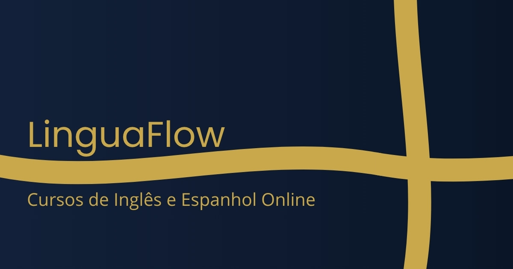

# 🌍 LinguaFlow — Landing Page

> Landing page responsiva para escola de idiomas, desenvolvida com HTML, CSS e JavaScript puros como projeto de portfólio.

<br>

## 🔗 Demo ao vivo

**[➜ Acessar o projeto](https://joaoepedro.github.io/linguaflow/)**

<br>

## 📸 Preview



<br>

## 🎯 Sobre o projeto

A **LinguaFlow** é uma landing page fictícia criada para estudo e portfólio, simulando uma escola de cursos de inglês e espanhol. O objetivo foi aplicar boas práticas de desenvolvimento front-end, design responsivo e otimização para conversão (CRO).

O projeto foi desenvolvido sem frameworks — HTML, CSS e JS puros — com foco em código limpo, fácil de personalizar e replicar para outros contextos.

<br>

## ✨ Funcionalidades

- ✅ Design responsivo — mobile, tablet e desktop
- ✅ Menu hamburger animado para mobile
- ✅ Animações de fade-in ao scroll (Intersection Observer)
- ✅ FAQ com accordion interativo
- ✅ Design system com variáveis CSS no `:root`
- ✅ HTML semântico (header, section, article, footer, nav)
- ✅ Open Graph configurado para redes sociais
- ✅ Scroll suave entre seções

<br>

## 🛠 Tecnologias

| Tecnologia | Uso |
|---|---|
| HTML5 | Estrutura semântica |
| CSS3 | Estilização, variáveis, responsividade |
| JavaScript (ES6+) | Interatividade, Intersection Observer |
| Google Fonts | Plus Jakarta Sans + Inter |

<br>

## 📁 Estrutura do projeto

```
linguaflow/
├── index.html                  # Estrutura da página
├── styles.css                  # Estilização e design system
├── scripts.js                  # Interatividade (menu, FAQ, scroll)
├── og-image.jpg                # Imagem para preview em redes sociais
├── favicon.ico                 # Ícone da aba do navegador
├── favicon-16x16.png           # Favicon para navegadores modernos
├── favicon-32x32.png           # Favicon para navegadores modernos
├── apple-touch-icon.png        # Ícone para iOS
├── android-chrome-192x192.png  # Ícone para Android
├── android-chrome-512x512.png  # Ícone para Android
├── site.webmanifest            # Configuração PWA
├── .gitignore
├── LICENSE
└── README.md
```

<br>

## 🎨 Design System

As cores, fontes e espaçamentos estão centralizados em variáveis CSS no `:root`, facilitando a personalização para outros projetos:

```css
:root {
  --color-navy:   #0A1628;   /* Fundo principal */
  --color-gold:   #C9A84C;   /* Destaque e CTAs */
  --color-text:   #E8ECF3;   /* Texto principal */
  --color-muted:  #9AA5B8;   /* Texto secundário */

  --font-display: 'Plus Jakarta Sans', sans-serif;
  --font-body:    'Inter', sans-serif;
}
```

<br>

## 📐 Seções da página

1. **Header** — Navegação fixa com menu hamburger para mobile
2. **Hero** — Título principal, subtítulo e CTAs
3. **Stats** — Números de prova social (+5.000 alunos, 98%, 12 anos)
4. **Features** — 4 diferenciais da escola em cards
5. **Cursos** — Cards de inglês e espanhol com detalhes
6. **Depoimentos** — 3 depoimentos com avatar e cargo
7. **Preços** — 3 planos com destaque para o mais popular
8. **FAQ** — Accordion interativo com 4 perguntas
9. **CTA Final** — Chamada para ação com fundo contrastante
10. **Footer** — Links, redes sociais e contato

<br>

## 🚀 Como rodar localmente

```bash
# Clone o repositório
git clone https://github.com/joaoepedro/linguaflow.git

# Entre na pasta
cd linguaflow

# Abra no navegador
# Basta abrir o arquivo index.html diretamente
# ou usar a extensão Live Server no VS Code
```

<br>

## 📚 Aprendizados

Este projeto foi desenvolvido com foco em:

- Estruturação de código front-end sem dependências externas
- Uso de CSS custom properties para criar um design system replicável
- Responsividade com media queries e abordagem mobile-first
- Boas práticas de SEO on-page (hierarquia de headings, meta tags, Open Graph)
- Princípios de CRO (Conversion Rate Optimization) aplicados ao layout

<br>

## 📄 Licença

Distribuído sob a licença MIT. Veja o arquivo [LICENSE](LICENSE) para mais detalhes.

<br>

---

<p align="center">
  Desenvolvido como projeto de portfólio por <strong>João Pedro Morais</strong>
</p>
